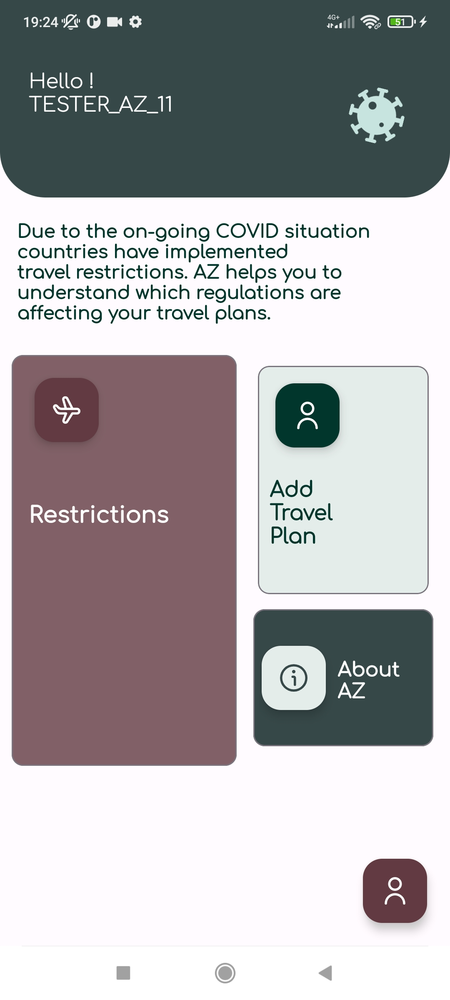
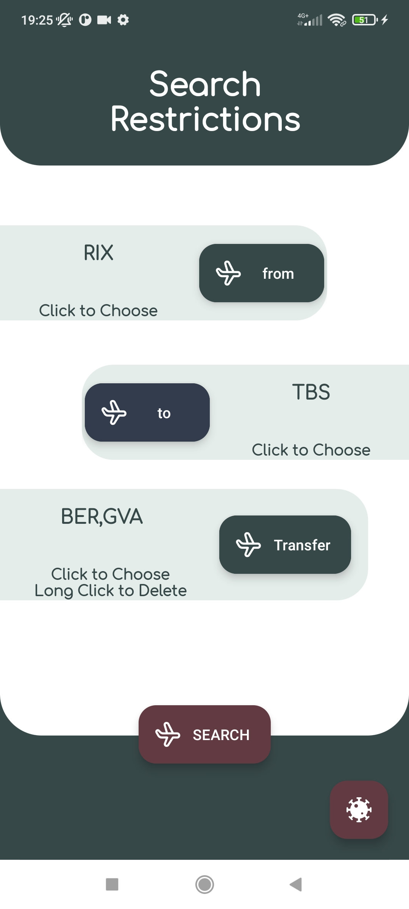
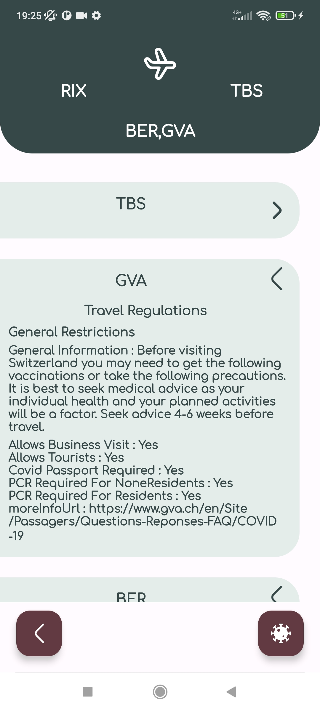
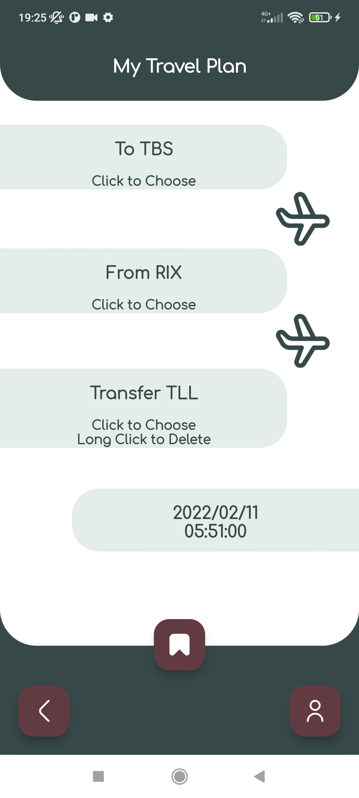
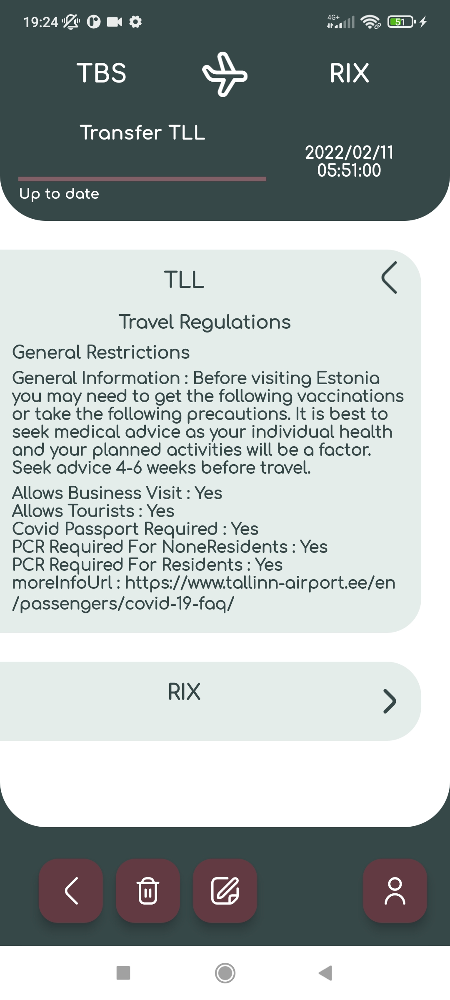
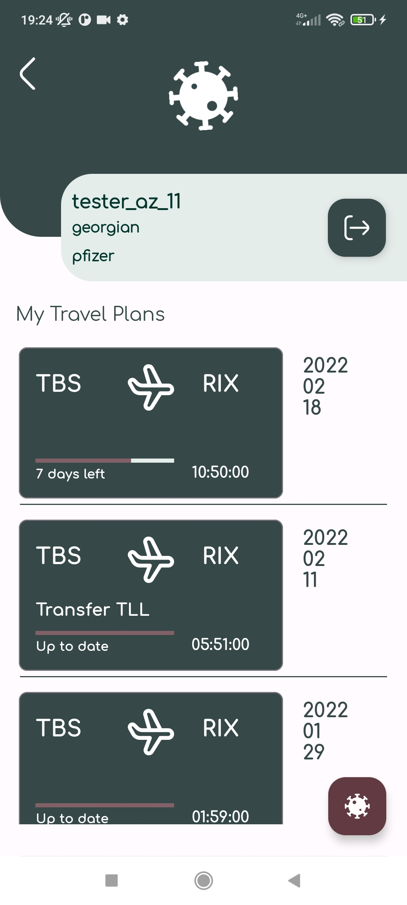
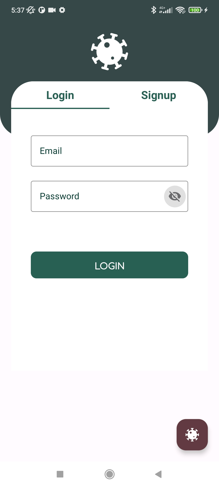
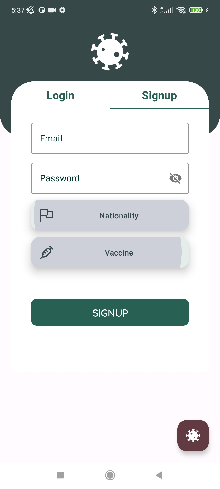
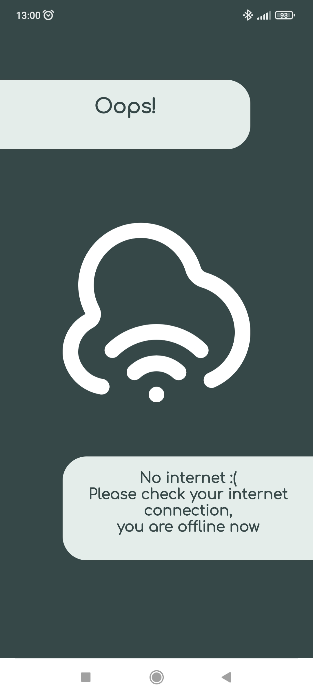

# AZ


[](https://lv.binarybabel.org/catalog/gradle/latest)
[](https://android-arsenal.com/api?level=21)


#### Inspiration && Problem

** Due to the on-going COVID situation countries have implemented travel restrictions,
which differ based on traveler and origin countries. This makes it hard for the traveller 
to understand which regulations are affecting their travel plans **

#### Goal

** A mobile application where users can quickly and efficiently check documentation
against travel restrictions imposed on the passenger by the authorities in the transit or
destination country. App crosschecks documentation against travel restrictions
imposed on the passenger by the authorities in the transit or destination country. Consequent
to inputing relevant travel information, app shall return the specific set of regulations, for
designated destination for the relevant users. **

### The application scope satisfies the following user stories:

** A mobile application where users can quickly and efficiently check documentation
against travel restrictions imposed on the passenger by the authorities in the transit or
destination country. App crosschecks documentation against travel restrictions
imposed on the passenger by the authorities in the transit or destination country. Consequent
to inputing relevant travel information, app shall return the specific set of regulations, for
designated destination for the relevant users. **

` This project is for everyone, easiest way to see worldwide restrictions `
#### Introduction to the user

* Splash Screen
* Intro pages (for first time run) `about page`
* Home Page for navigation ->  `click fab` -> (if logged to user page else login/signup page)
* Login and SignUp Page 
* User Page with user infromation and travel plans
* Travel Plan page with restrictions ->  to create, edit, delete and see travel plans details with its left days
* Restriction -> to search restrictions, if user is logged it gives one detailed infromation about restrictions with their vaccine and nationalities.

### Screenshots
###
Home Page | Restriction Form | Restriction Result | Travel Plan Form  | Travel Plan Result
---|---|---|---|---
 |  |   | |  | 

User Home Page | About Form | Login | Sign Up |Splash Screen
---|---|---|---|---
 | | | | 

No Internet | 
---|
 | 


## Project characteristics and tech-stack
* Tech-stack
    * [100% Kotlin](https://kotlinlang.org/) + [Coroutines](https://kotlinlang.org/docs/reference/coroutines-overview.html) + [Flow](https://developer.android.com/reference/androidx/constraintlayout/helper/widget/Flow) - perform background operations
    * [Dagger2](https://github.com/google/dagger) - Dependency Injection lib with large community support.
    * [Retrofit](https://square.github.io/retrofit/) - Network Http Client
    * [Jetpack](https://developer.android.com/jetpack)
        * [Navigation](https://developer.android.com/topic/libraries/architecture/navigation/) - in-app navigation
        * [Flow](https://developer.android.com/kotlin/flow) 
        * [ViewModel](https://developer.android.com/topic/libraries/architecture/viewmodel) - store and manage UI-related data in a lifecycle conscious way
    * [Lottie](http://airbnb.io/lottie) - animation library
    * [okhttp-logging-interceptor](https://github.com/square/okhttp/blob/master/okhttp-logging-interceptor/README.md) - logs HTTP request and response data.
    * [Moshi](https://github.com/square/moshi) - Data, Model & Entity JSON Parser that understands Kotlin non-nullable and default parameters
    * [Paging 3](https://developer.android.com/topic/libraries/architecture/paging/v3-migration) -  Load and display paged data
    * [Splash Screen](https://developer.android.com/guide/topics/ui/splash-screen) - Splash screen with theme and animations
    * [SharedPreferences](https://developer.android.com/reference/android/content/SharedPreferences) - For first time intro pages and for saving user info
    * [ViewPager2](https://developer.android.com/jetpack/androidx/releases/viewpager2) - Swipe views allow you to navigate between tabs (Movies, Series), intro pages and for trailers 
    * extensions - to add methods to class without inheriting a class or using any type of design pattern. 
* Modern Architecture
    * Clean Architecture (at feature module level)
    * Single activity architecture using [Navigation component](https://developer.android.com/guide/navigation/navigation-getting-started)
    * MVVM  (presentation layer)
    * [Dynamic feature modules](https://developer.android.com/studio/projects/dynamic-delivery)
    * [Android Architecture components](https://developer.android.com/topic/libraries/architecture) ([ViewModel](https://developer.android.com/topic/libraries/architecture/viewmodel), 
    * [Navigation](https://developer.android.com/jetpack/androidx/releases/navigation))
* UI
    * [Material design](https://material.io/design)
* Gradle
    * [Gradle Kotlin DSL](https://docs.gradle.org/current/userguide/kotlin_dsl.html)
    * Custom tasks
    * Plugins ([SafeArgs](https://developer.android.com/guide/navigation/navigation-pass-data#Safe-args),
      [android-junit5](https://github.com/mannodermaus/android-junit5))

The full list of dependencies are written in the **build.gradle** files.


## Getting started

There are a few ways to open this project.

### Android Studio

1. `Android Studio` -> `File` -> `New` -> `From Version control` -> `Git`
2. Enter `https://github.com/annzzu/AZ.git` into URL field an press `Clone` button

### Command-line + Android Studio

1. Run `git clone https://github.com/annzzu/AZ.git` command to clone project
2. Open `Android Studio` and select `File | Open...` from the menu. Select cloned directory and press `Open` button


`API in gradle.properties`
```gradle.properties
SERVER_URL=http://covid-restrictions-api.noxtton.com/
```


### Android projects by me
- [AZMovie](https://github.com/annzzu/AZMovie) - AZMovie - For  for watching movies and series without any ads.
- [AZ Light](https://github.com/annzzu/AZLight) - AZLight - AZLight is a small android app for connecting esp8266 to turn on and off lights.

## Questions
If you have any questions about this projects, please contact me directly at 
